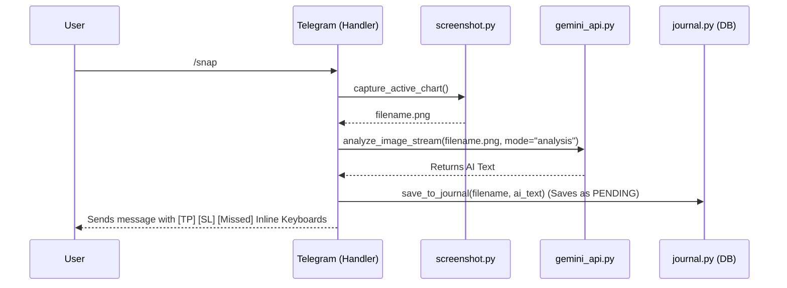

# Application Workflows & Callbacks

## 1. The SNAP Workflow

The `snap` feature encompasses taking a desktop screenshot, uploading it to the Gemini API, returning the response, and storing it into the SQLite Database as a `PENDING` trade.

## 2. Interactive Results Callback (`callbacks.py`)

When the user clicks a button (`WIN`, `LOSS`, `MISSED`) underneath the AI analysis message:

1. `bot.callback_query_handler` intercepts the string (e.g., `res_win|XAUUSD_...png`).
2. The user is prompted to reply with the **Risk:Reward (RR)** ratio (ForceReply).
3. The answer is trapped via `register_next_step_handler(rr_step)`.
4. Next, the user is prompted to reply with the **Profit/Loss (PnL_USD)**.
5. The answer is trapped via `register_next_step_handler(pnl_step)`.
6. Lastly, `journal.save_to_journal()` is triggered as an **UPSERT**.
   - It searches for `filename.png` in `screenshots`.
   - Update/Insert the specific `journal_entries` row, moving it from `PENDING` -> `WIN` and attaching the given `rr` & `pnl_usd`.

## 3. Web App Stats Viewing
1. User types `/stats`.
2. The bot replies with a text summary and an `InlineKeyboardMarkup` containing a `WebAppInfo` button pointing to the `WEBAPP_URL`.
3. User clicks the button and the Telegram App opens a customized web browser overlay.
4. The overlay loads `index.html` which executes `app.js`.
5. `app.js` runs an async fetch to `/api/trades` (Flask backend).
6. Flask queries SQLite and returns the history.
7. JS renders the interactive heatmap grid matching the exact actual calendar layout of the current month (Padding the 1st day respectively).
